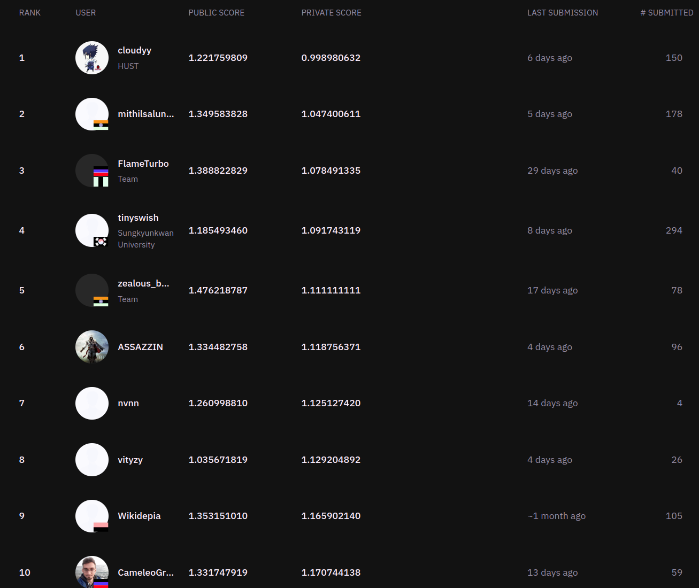

# 2nd place solution for Zindi [Boll worm Counting Challenge](https://zindi.africa/competitions/wadhwani-ai-bollworm-counting-challenge) Hosted by [Wadhwani AI](https://www.wadhwaniai.org/)

# Challenge Description

`During the kharif season of 2017, cotton farmers across India lost large portions of their crop to a pest known as
boll-worms. Since then, farmers have been encouraged to install pheromone traps in their fields as part of a larger
effort to control the problem. Pheromone traps capture male boll-worms that are capable of reproducing. By counting the
number of boll-worms caught in such traps, farmers can estimate potential boll-worm infestation to make informed
decisions
about whether pesticides should be applied to minimize future damage.`

# Solution

## Step 1 - Data preparation

### Use this colab  notebook to learn how I did data preparation - [Data_preparation_wadhwani_AI](https://github.com/king398/PestDetectFinal/blob/master/Data_preparation_wadhwani_ai.ipynb)

## Step 2 - Training And Inference

### For convenience , I merged by training and inference nb in one nb. nb link - [Train_YoloV5](https://github.com/king398/PestDetectFinal/blob/master/Train_YoloV5.ipynb)

# Author

| Author          |                                 GitHub | zindi Id                                                     | Zindi Team Name | 
|-----------------|---------------------------------------:|--------------------------------------------------------------|-----------------|
| Mithil Salunkhe | [@king398](https://github.com/king398) | [@mithilsalunkhe](https://zindi.africa/users/mithilsalunkhe) | mithilsalunkhe  |

# Leaderboard For the  Competitions

